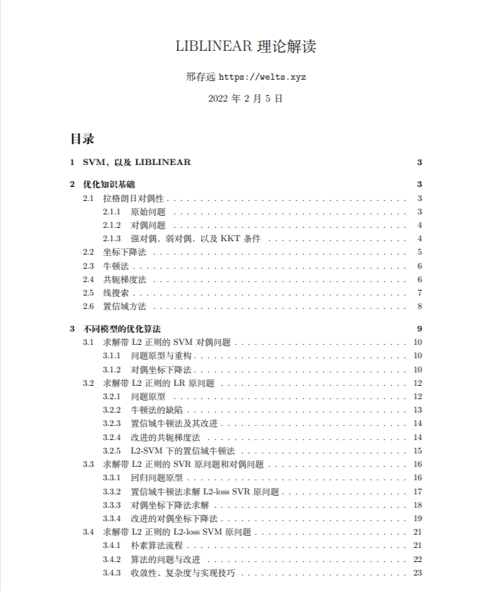
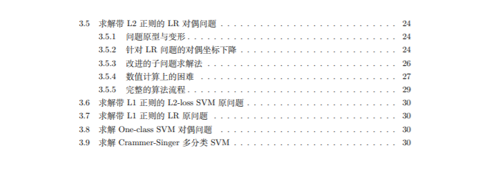

# LIBLINEAR理论解读

[LIBLINEAR](https://www.csie.ntu.edu.tw/~cjlin/liblinear/)是用于大型线性分类与回归的流行软件包，在支持多种算法的同时也支持多平台多功能的机器学习。相比于LIBSVM，LIBLINEAR丢弃了SVM中的核方法，只支持线性分类，但大大增加了模型对大数据的适应能力。笔者在阅读完LIBSVM源码后（<https://github.com/Kaslanarian/libsvm-sc-reading>）便着手于LIBLINEAR源码的阅读，随后发现LIBLINEAR涉及到的优化知识要比LIBSVM多（LIBSVM只有拉格朗日对偶法和SMO算法）。因此将工作重心先放在了理论基础上，然后再研究代码(主要是C++)。

## 理论部分

我们在`theory.pdf`中记录LIBLINEAR中设计到的知识基础和优化方法:





LIBLINEAR总共可以求解12种问题，除了Crammer-Singer的多分类模型和One-class SVM对偶问题之外，剩余的10种优化问题可总结为“带L1/L2正则化的某种损失函数的分类/回归模型的原/对偶问题”，具体如表1所示

| 基础模型 | L1正则化的原问题 | L2正则化的原问题 | L2正则化的对偶问题 |
| :------: | :--------------: | :--------------: | :----------------: |
|  L1-SVC  |                  |                  |         √          |
|  L2-SVC  |        √         |        √         |         √          |
|    LR    |        √         |        √         |         √          |
|  L1-SVR  |                  |                  |         √          |
|  L2-SVR  |                  |        √         |         √          |

<center>表1: LIBLINEAR支持的问题类型

基础模型前三种为分类模型，其中第三个模型为对率回归(逻辑回归, Logistic Regression, LR)，后两个模型为回归模型。模型中的"L1"和"L2"表示损失函数类型而不是正则化，具体可见[`theory.pdf`](./theory.pdf)。

<<<<<<< HEAD
以下为目前笔者的文献阅读和研究进度，表格中为对应问题的优化方法(==已完成==):
=======
以下为目前笔者的文献阅读和研究进度，其中"?"表示笔者并未弄清该问题的优化算法(**更新中**):
>>>>>>> 2a1f5771ba790041518733b8af66abe2a6b8b335

| 基础模型 | L1正则化的原问题 | L2正则化的原问题 | L2正则化的对偶问题 |
| :------: | :--------------: | :--------------: | :----------------: |
|  L1-SVC  |                  |                  |         CD         |
|  L2-SVC  |      CD+LS       |      CD+LS       |         CD         |
|    LR    |      CD+LS       |     TRON+CG      |         CD         |
|  L1-SVR  |                  |                  |         CD         |
|  L2-SVR  |                  |     TRON+CG      |         CD         |

> - CD: Coordinate descent, 即坐标下降算法；
> - TRON: Trust region newton method, 带置信域的牛顿法；
> - CG: Conjugate gradient, 共轭梯度法；
> - LS: Line search, 线搜索算法.

下面是剩余两种算法的研究进度(==已完成==):

- [x] Crammer-Singer多分类：坐标下降法；
- [x] One-class SVM对偶问题：外贪心内循环的二层坐标下降框架.

## 获取

<<<<<<< HEAD
通过

```bash
git clone https://github.com/Kaslanarian/liblinear-sc-reading
```

获取文件。

## 文献清单

下面列出笔者阅读过的主要文献，LIBLINEAR中的各种优化算法**全部**出于下面的论文。如果觉得本文有表述不清的地方可以查阅原文。

1. [LIBLINEAR: A library for large linear classification](https://www.jmlr.org/papers/volume9/fan08a/fan08a.pdf)：LIBLINEAR的综述论文;
2. [A dual coordinate descent method for large-scale linear SVM](https://dl.acm.org/doi/abs/10.1145/1390156.1390208)：坐标下降法求解SVM分类对偶问题；
3. [Trust region Newton method for large-scale logistic regression](https://www.jmlr.org/papers/volume9/lin08b/lin08b.pdf)：置信域牛顿法求解对率回归原问题；
4. [Large-scale linear support vector regression](https://www.jmlr.org/papers/volume13/ho12a/ho12a.pdf)：求解支持向量回归原问题和对偶问题的算法；
5. [Coordinate descent method for large-scale l2-loss linear support vector machines](https://www.jmlr.org/papers/volume9/chang08a/chang08a.pdf)：坐标下降求解L2-loss SVM原问题；
6. [Dual coordinate descent methods for logistic regression and maximum entropy models](https://link.springer.com/article/10.1007/s10994-010-5221-8)：坐标下降法求解对率回归(逻辑回归)的对偶问题；
7. [A comparison of optimization methods and software for large-scale l1-regularized linear classification](https://www.jmlr.org/papers/volume11/yuan10c/yuan10c.pdf)：L1正则化下的对率回归与L2-loss SVM的求解（这篇文章也是对L1正则的优化算法综述）；
8. [Dual coordinate-descent methods for linear one-class SVM and SVDD](https://epubs.siam.org/doi/abs/10.1137/1.9781611976236.21)：二层坐标下降法框架求解单类SVM的对偶问题（同时也提出了支持向量数据描述(SVDD)的训练方法）；
9. [A sequential dual method for large scale multi-class li](https://dl.acm.org/doi/abs/10.1145/1401890.1401942)：坐标下降法求解多分类SVM.

你可以在<https://welts.xyz>中找到笔者对这些文献的解读。我们这里省略了一些辅助文献，详情可查看pdf中的参考文献。
