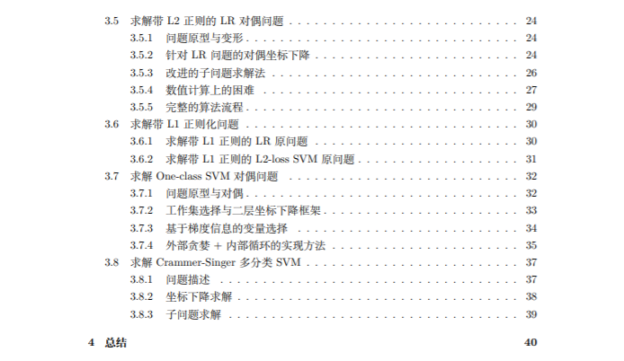

# LIBLINEAR理论与源码解读

[LIBLINEAR](https://www.csie.ntu.edu.tw/~cjlin/liblinear/)是用于大型线性分类与回归的流行软件包，在支持多种算法的同时也支持多平台多功能的机器学习。相比于LIBSVM，LIBLINEAR丢弃了SVM中的核方法，只支持线性分类，但大大增加了模型对大数据的适应能力。笔者在阅读完LIBSVM源码后（<https://github.com/Kaslanarian/libsvm-sc-reading>）便着手于LIBLINEAR源码的阅读，随后发现LIBLINEAR涉及到的优化知识要比LIBSVM多（LIBSVM只有拉格朗日对偶法和SMO算法）。因此将工作重心先放在了理论基础上，然后再研究代码(主要是C++)。

## 理论部分

我们在`theory.pdf`中记录LIBLINEAR中设计到的知识基础和优化方法:

LIBLINEAR总共可以求解12种问题，除了Crammer-Singer的多分类模型和One-class SVM对偶问题之外，剩余的10种优化问题可总结为“带L1/L2正则化的某种损失函数的分类/回归模型的原/对偶问题”，具体如表1所示

| 基础模型 | L1正则化的原问题 | L2正则化的原问题 | L2正则化的对偶问题 |
| :------: | :--------------: | :--------------: | :----------------: |
|  L1-SVC  |                  |                  |         √          |
|  L2-SVC  |        √         |        √         |         √          |
|    LR    |        √         |        √         |         √          |
|  L1-SVR  |                  |                  |         √          |
|  L2-SVR  |                  |        √         |         √          |

表1: LIBLINEAR支持的问题类型

基础模型前三种为分类模型，其中第三个模型为对率回归(逻辑回归, Logistic Regression, LR)，后两个模型为回归模型。模型中的"L1"和"L2"表示损失函数类型而不是正则化，具体可见[`theory.pdf`](./theory.pdf)。

以下为目前笔者的文献阅读和研究进度，其中"?"表示笔者并未弄清该问题的优化算法(**更新中**):

| 基础模型 | L1正则化的原问题 | L2正则化的原问题 | L2正则化的对偶问题 |
| :------: | :--------------: | :--------------: | :----------------: |
|  L1-SVC  |                  |                  |        DCD         |
|  L2-SVC  |        ?         |      CD+LS       |        DCD         |
|    LR    |        ?         |       TRON       |        DCD         |
|  L1-SVR  |                  |                  |        DCD         |
|  L2-SVR  |                  |       TRON       |        DCD         |

> - CD: Coordinate descent, 即坐标下降算法；
> - TRON: Trust region newton method, 带置信域的牛顿法；
> - DCD: Dual coordinate descent, 对偶坐标下降法；
> - LS: Line search, 线搜索算法.

下面是剩余两种算法的研究进度(**更新中**):

- [ ] Crammer-Singer多分类；
- [ ] One-class SVM对偶问题.

## 代码部分

在`code.pdf`中是对LIBLINEAR的C++源码的解读，笔者打算读完理论后再写也不迟。
